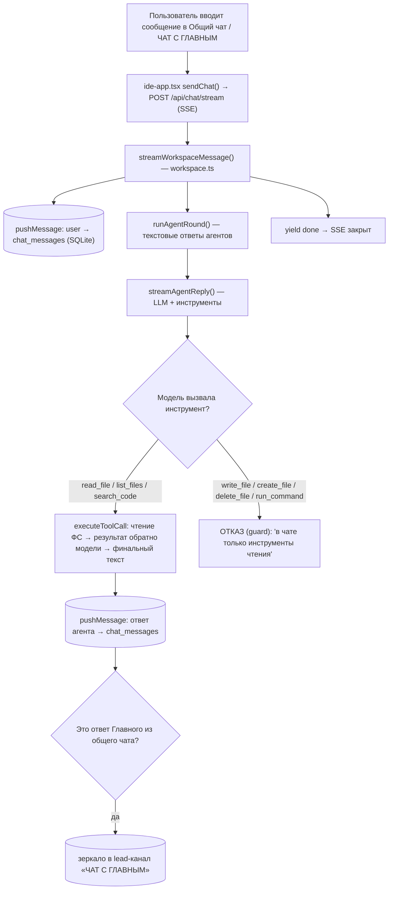
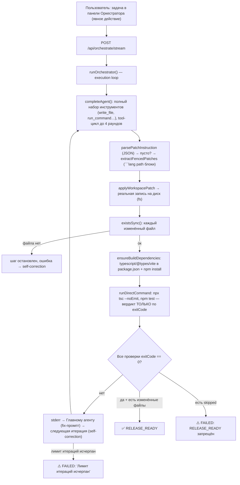

# Data Flow Audit: контуры ЧАТА и ОРКЕСТРАТОРА

Дата аудита: 31.08.2026 · Версия: 1.5.20 · Ветка: main

## 1. Контур «Чат / Диалог» (Conversational Loop) — только текст

Ввод сообщения пользователем порождает **только текстовые ответы агентов**.
Файлы не пишутся, консольные команды не выполняются, авто-цикл не запускается.

**Гарантии контура чата (код):**
- `filterToolDefinitions(agent.role, CHAT_TOOL_NAMES)` — в conversation-цикле
  агенту выдаются **только read-only инструменты** (`read_file`, `list_files`,
  `search_code`). `write_file`, `create_file`, `delete_file`, `run_command`
  отсутствуют в схеме для модели.
- Guard в tool-цикле: даже если модель проигнорировала инструкцию и эмитнула
  write/run — `isReadOnlyTool()` отклоняет вызов, модели возвращается отказ.
- Запуск auto-cycle из чата **полностью удалён**: `streamWorkspaceMessage`
  завершается после ответов агентов (строгий запрет, см. п.2).

## 2. Контур «Оркестратор / Исполнение» (Execution Loop)

Запускается **только явным действием пользователя** — отправкой задачи в
панели Оркестратора (кнопка запуска задачи / «Сгенерировать код»).

Запись на диск возможна **только** в этом контуре: `applyWorkspacePatch`
(патчи), tool-цикл `completeAgent` (полные инструменты), `ensureBuildDependencies`
(автозапись dev-зависимостей).

Зеркало статусов в «Общий чат агентов» — `mirrorToGroupChat()` через
`pushMessage({ toChat: true })`: 🚀 старт задачи, 🔧 применён патч, ❌ провал
проверок (stderr), ⚠️ FAILED, ✅ RELEASE_READY, ⏹ отмена.

## 3. Условия триггера авто-цикла (было → стало)

| Было (до исправления) | Стало |
|---|---|
| AUTO ☑ + **любое** сообщение в общий чат → фоновый auto-cycle (review/fix до 4 итераций, cap 10 мин) | **Удалено.** Чат не запускает авто-цикл ни при каких условиях |
| AUTO ☑ влиял только на фоновый чат-цикл | AUTO ☑ = режим Оркестратора: при старте задачи без явного mode — `autonomous` (иначе `controlled`) |

**Единственный триггер исполнения сейчас:** явная отправка задачи в панель
Оркестратора → `/api/orchestrate/stream`.

## 4. MAX_ITERATIONS / принудительное завершение

**Оркестратор (execution loop):**
- `maxIterations` — по умолчанию **5**, диапазон clamp **5…10**.
- Одна итерация = план/анализ → патч → проверки. Провал проверок → следующая
  итерация с stderr в fix-промпте (self-correction, до 5 попыток по умолчанию).
- Принудительное завершение:
  1. Все проверки `exitCode == 0` + есть изменённые файлы → `RELEASE_READY`.
  2. Любая проверка `skipped` → `FAILED` (немедленно).
  3. Исчерпан `maxIterations` → `FAILED` «Лимит итераций исчерпан».
  4. Отмена пользователя (`/api/orchestrate/cancel`, abort) → `cancelled`.
  5. Ошибка генерации (обрезанный JSON при отсутствии патчей) → `GENERATION_ERROR` → `FAILED`.

**Таймауты, страхующие от вечного «Выполняется»:**
- Gateway: connect-timeout 120 c на попытку; idle/stall-таймаут стрима 120 c
  без данных → 408 → фолбэк модели (3 ретрая + exponential backoff, Retry-After).
- Клиентский watchdog чата: 180 c без SSE-блоков → разрыв, кнопка «Остановить» сбрасывается.
- Оркестратор: проверки 300 c на команду; подтверждения в controlled-режиме — 10 мин.
- Устаревший файл `orchestrator-active.json` (после рестарта) сбрасывается при
  первом опросе `/api/orchestrate/state` — UI не зависает на «Выполняется».

## 5. Инструменты по контурам

| Инструмент | Чат | Оркестратор |
|---|---|---|
| read_file / list_files / search_code | ✅ | ✅ |
| write_file / create_file / delete_file | ❌ guard-отказ | ✅ |
| run_command | ❌ guard-отказ | ✅ (sandbox + verification через direct exec) |

## 6. Точки хранения

- Сообщения чата и зеркала: `chat_messages` (канал `group` / `lead`).
- Размышления авто-обсуждений и служебные события: `system_events` (панель ЛОГИ).
- История файлов и откатов: `file_history`, `workspace_file_history` + `.multi-agent-backups/`.
- Состояние задачи оркестратора: `orchestrator-active.json` (авто-сброс при «осиротении»).
